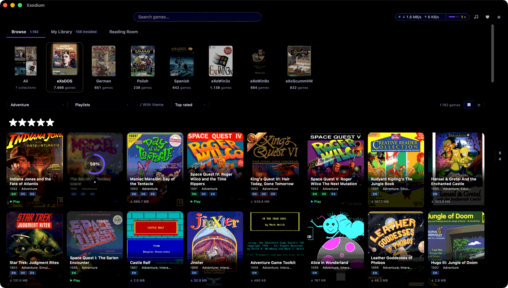

<p align="center">
  
</p>

<h1 align="center">Exodium</h1>

<p align="center">
  A cross-platform launcher for the <a href="https://www.retro-exo.com/exodos.html">eXoDOS</a> collections. Browse, download, and play DOS, Windows 3.x, Windows 9x, and ScummVM games on Linux, macOS, and Windows.
</p>

<p align="center">
  <a href="https://github.com/tvollstaedt/exodium/releases/latest"></a>
  <a href="LICENSE"></a>
  
  
  
</p>

<p align="center">
  
</p>

---

## Quick start

1. **Download** the latest release for your platform:
   [Windows (.exe)](https://github.com/tvollstaedt/exodium/releases/latest/download/Exodium-windows-x64-setup.exe) ·
   [macOS (.dmg)](https://github.com/tvollstaedt/exodium/releases/latest/download/Exodium-macos-aarch64.dmg) ·
   [Linux (.AppImage)](https://github.com/tvollstaedt/exodium/releases/latest/download/Exodium-linux-x86_64.AppImage) ·
   [all downloads](https://github.com/tvollstaedt/exodium/releases/latest)
2. **Install and launch** - see [Installation](#installation) for platform notes.
3. **Pick a games folder** in the setup wizard - this is where downloaded games are stored.
4. **Browse and play** - hit download on any game; it streams from the eXo torrents and launches in the emulator it was configured for.

---

## A tribute to eXoDOS

Exodium would not exist without the extraordinary work of the [eXoDOS project](https://www.retro-exo.com/exodos.html) and its creator, **eXo**. Over many years, eXo and the eXoDOS community have painstakingly collected, configured, and preserved over 9,000 DOS games, each one pre-configured to run out of the box. The result is an irreplaceable archive of gaming history.

Exodium is a frontend client for that collection. It does not host or distribute any game files; it uses the eXoDOS torrents that you seed yourself. If you find value in Exodium, please consider supporting the eXoDOS project directly at [retro-exo.com](https://www.retro-exo.com).

---

## What it does

eXoDOS ships with a Windows-only LaunchBox frontend and requires downloading the full ~500 GB torrent to browse the catalogue. Exodium replaces that frontend with a small native app for Linux, macOS, and Windows.

### Available now
- ✅ Browse the eXoDOS catalogue alongside the German, Spanish, and Polish language packs
- ✅ The Windows collections as well: eXoWin3x runs under DOSBox Staging, eXoWin9x boots a real Windows 95/98
- ✅ eXoScummVM too - each game runs on the ScummVM build eXo pinned it to, fetched for you, with a picker for edition, sound hardware, and subtitles
- ✅ Stream individual games on demand - no full collection download required
- ✅ Launch via bundled DOSBox Staging with no external dependencies
- ✅ MT-32 and General MIDI music - Roland ROMs and the SoundCanvas soundfont are fetched from the collection and eXoDOS' DOSBox-ECE configs are translated for DOSBox Staging automatically
- ✅ Game manuals and per-game media galleries - box scans, in-game screenshots, and ads
- ✅ Preview videos read straight out of the collection's archives, without downloading the game first
- ✅ A theme player - a game's theme streams from its archive when you open its details, and Browse doubles as a jukebox over the games that have one
- ✅ Per-game settings - CRT shader, fullscreen, CPU cycles, and a free-form DOSBox config editor
- ✅ Favorites, playlists, and a personal library of installed games

> **Compatibility note:** DOS and Windows 3.x games run under the bundled DOSBox Staging, ScummVM games under the pinned ScummVM build Exodium fetches for them. A handful are tuned for DOSBox-ECE specials such as 3dfx Voodoo settings or the GunStick light gun and may look or behave slightly differently than under the original Windows eXoDOS setup. Windows 9x games need DOSBox-X or 86Box, which Exodium fetches with your first Windows 9x download.

### Planned
- 🔲 Pausing and resuming downloads, and a history of what has been fetched
- 🔲 Support for other eXo collections - eXoDREAMM, eXoIF, and future releases

---

## Screenshots

<p align="center">
  
</p>

<p align="center"><em>Game detail panel with description, metadata, and one download size per available language.</em></p>

<p align="center">
  
</p>

<p align="center"><em>Per-game media gallery. Flip through original box scans, magazine ads, and in-game shots.</em></p>

<p align="center">
  
</p>

<p align="center"><em>Several games download at once, straight from the eXoDOS torrents, with the peer count and how much you have shared back.</em></p>

---

## Installation

Download the binary for your platform from the [latest release](https://github.com/tvollstaedt/exodium/releases/latest).

### macOS

Because Exodium is not yet signed with an Apple Developer ID, macOS Gatekeeper will block it on first launch with "Exodium is damaged and cannot be opened". To bypass this, run the following once after dragging the app to Applications:

```bash
xattr -cr /Applications/Exodium.app
```

This removes the quarantine attribute that macOS adds to downloaded files. The app is otherwise unmodified - the binary itself is built and distributed directly from this repo's CI pipeline.

### Linux

Install the `.deb` (Debian/Ubuntu) or run the `.AppImage` directly (any distro). The AppImage needs `chmod +x` first.

### Windows

One installer is provided: `Exodium_<version>_x64-setup.exe` (NSIS). It is currently **unsigned**, so Windows will block it by default. Trusted code signing is planned for a future release. (Releases up to v0.8.3 also shipped an `.msi`; it was dropped because the auto-updater delivers NSIS updates, and Windows cannot cleanly update an MSI install with an NSIS installer.)

**Install: NSIS `.exe` + Unblock-File**

1. Download `Exodium_<version>_x64-setup.exe`.
2. Open PowerShell and unblock the downloaded file:

   ```powershell
   Unblock-File "$HOME\Downloads\Exodium_<version>_x64-setup.exe"
   ```
3. Run the installer normally. SmartScreen may still show a warning - click "More info" → "Run anyway".

If `Unblock-File` is unavailable, right-click the `.exe` → Properties → tick "Unblock" at the bottom of the General tab → OK.

**If downloads are stuck at 0%**: check `%APPDATA%\Exodium\logs\exodium.log` for error details. Firewall issues are one possible cause - allow both "Private" and "Public" networks for Exodium under Windows Security → Firewall & network protection → Allow an app through firewall.

---

## Tech stack

| Layer | Technology |
|-------|-----------|
| Shell | [Tauri v2](https://tauri.app) (frameless window, `decorations: false`) |
| Frontend | [SolidJS](https://solidjs.com) + TypeScript + Vite |
| UI Components | [Ark UI](https://ark-ui.com) headless (`@ark-ui/solid`) |
| Backend | Rust |
| Database | SQLite via `rusqlite` (WAL mode, pre-built and shipped with the app) |
| Torrent | [librqbit](https://github.com/ikatson/rqbit) with selective file downloads |

---

## Development

### Prerequisites

- [pnpm](https://pnpm.io)
- [Rust toolchain](https://rustup.rs) - bootstrapped automatically by `pnpm tauri dev` if not present
- [aria2](https://aria2.github.io) - for `init-dev` only (`brew install aria2` / `apt install aria2`)
- Python 3 + [Pillow](https://python-pillow.org) - for `init-dev` only (`pip3 install Pillow`)

> DOSBox Staging is downloaded automatically by `init-dev`. No manual installation needed.

### First-time setup

```bash
pnpm install

# Download thumbnails and the DOSBox binary (one-time, ~2-5 GB depending on language packs)
pnpm run init-dev

pnpm tauri dev
```

`init-dev` is idempotent - already-downloaded files and existing thumbnails are skipped. Use `--force` to regenerate thumbnails. Data is cached at `~/.exodium-dev/` (override with `XDO_DEV_DATA=/your/path`).

Language pack options:

```bash
pnpm run init-dev --glp     # German Language Pack (~23 GB)
pnpm run init-dev --slp     # Spanish Language Pack (~3.8 GB)
pnpm run init-dev --plp     # Polish Language Pack (~800 MB)
pnpm run init-dev --all-packs
```

### Useful scripts

| Command | Description |
|---------|-------------|
| `pnpm tauri dev` | Start the app in development mode |
| `pnpm run init-dev` | First-time setup: DOSBox binary + thumbnails |
| `pnpm run get-dosbox` | Download DOSBox Staging binary only |
| `pnpm test` | Run frontend tests (Vitest) |
| `pnpm run test:all` | Frontend + Rust tests |

### Regenerating the game database

The pre-built SQLite database (`metadata/exodium.db.gz`) ships with the app. To regenerate it from the bundled XML sources:

```bash
cd src-tauri
cargo run --example generate_db
gzip -k ../metadata/exodium.db
```

---

## Project structure

```
exodium/
├── src/                    SolidJS frontend
│   ├── api/tauri.ts        Typed invoke() wrappers
│   ├── components/         GameCard, GameDetailPanel, SearchBar, WindowFrame, ...
│   ├── pages/              Intro, Setup, Library
│   └── stores/             games, downloads, thumbnails
├── src-tauri/
│   └── src/
│       ├── examples/       generate_db build tool (not shipped)
│       ├── commands/       Tauri commands (games, setup, updates)
│       ├── db/             SQLite schema + queries
│       ├── import/         LaunchBox XML parser
│       └── torrent/        librqbit download manager
├── metadata/               Bundled XML sources + pre-built DB (.gz)
├── scripts/
│   ├── init-dev.sh         First-time dev setup
│   └── gen_thumbnails.py   Resize + rename box art from XODOSMetadata.zip
├── manifest.json           Update-check manifest (torrent infohashes + thumbnail pack info)
├── thumbnails/eXoDOS/      Shortcode-keyed game thumbnails (gitignored, generated by init-dev)
└── torrents/               .torrent files for every collection
```

---

## Support

Found a bug or have a question? Open an [issue](https://github.com/tvollstaedt/exodium/issues) - include `exodium.log` from the app's log folder (Settings → Open log folder) for download or launch problems.

If Exodium is useful to you, consider donating via [GitHub Sponsors](https://github.com/sponsors/tvollstaedt) or [Ko-fi](https://ko-fi.com/tvollstaedt). Donations go toward OS code-signing certificates (Apple Developer ID, Windows signing) so the install warnings on macOS and Windows can go away.

---

## License

MIT - see [LICENSE](LICENSE).

Exodium does not include any game files, ROM images, or copyrighted eXoDOS assets. All game data is downloaded via the official eXoDOS torrents.
